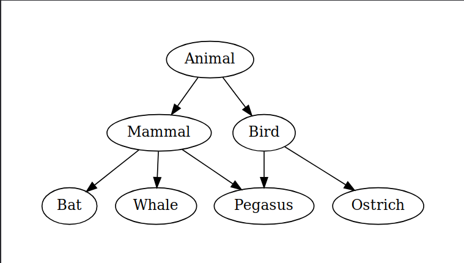

# C++ Inheritance Analyzer 

A **Python-based tool** for parsing C++ source files and visualizing class inheritance hierarchies as ASCII trees or Graphviz diagrams.

---

## 🚀 Features

- **Parses** `.cpp` and `.h` files
- **Extracts** class declarations and inheritance chains
- **Detects:**
    - Multiple inheritance
    - Abstract base classes
    - Undefined base class references
    - Duplicate class declarations
- **Visualizes** results as:
    - Text-based tree output
    - Graphviz `.pdf` diagrams
- **Interactive terminal interface** using [`questionary`](https://github.com/tmbo/questionary)
- **Functional test suite** with [`pytest`](https://docs.pytest.org/)

---

## 🧰 Technologies Used

- **Python 3**
- Standard libraries: `re`, `os`, `typing`
- [`graphviz`](https://graphviz.readthedocs.io/) for tree rendering
- [`pytest`](https://pytest.org/) for testing
- [`questionary`](https://github.com/tmbo/questionary) for terminal UI

---

## 🏁 Getting Started

```bash
python3 main.py
```

## 🧪 Run Tests

```bash
PYTHONPATH=. pytest test/test_functional_cases.py
```

---

## ✨ Example Usage
### Source C++ Code

```cpp
// test/samples/tc12_medium_size_inheritance.cpp
#include <iostream>

// Sample inheritance structure for testing

class Animal {
};

class Mammal : public Animal {
};

class Bird : public Animal {
};

class Bat : public Mammal {
};

class Ostrich : public Bird {
};

class Whale : public Mammal {
};

class Pegasus : public Mammal, public Bird {
};
```

### Output in Graphviz format:


### Or in ASCII format:
```bash
└── Animal
    ├── Mammal
    │   ├── Bat
    │   ├── Whale
    │   └── Pegasus (inherits from: Mammal, Bird)
    └── Bird
        ├── Ostrich
        └── Pegasus
```
